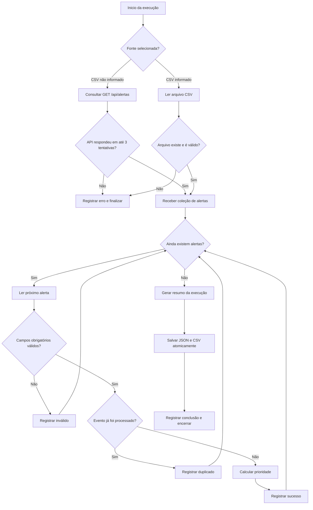

# Fluxo BPMN do RPA

```mermaid
flowchart TD
    A[Inicio da execução] --> B{Fonte selecionada?}
    B -->|CSV informado| C[Ler arquivo CSV]
    B -->|CSV não informado| D[Consultar GET /api/alertas]
    D --> E{API respondeu em até 3 tentativas?}
    E -->|Não| F[Registrar erro e finalizar]
    E -->|Sim| G[Receber coleção de alertas]
    C --> H{Arquivo existe e é válido?}
    H -->|Não| F
    H -->|Sim| G
    G --> I{Ainda existem alertas?}
    I -->|Não| P[Gerar resumo da execução]
    I -->|Sim| J[Ler próximo alerta]
    J --> K{Campos obrigatórios válidos?}
    K -->|Não| L[Registrar inválido]
    K -->|Sim| M{Evento já foi processado?}
    M -->|Sim| N[Registrar duplicado]
    M -->|Não| O[Calcular prioridade]
    O --> Q[Registrar sucesso]
    L --> I
    N --> I
    Q --> I
    P --> R[Salvar JSON e CSV atomicamente]
    R --> S[Registrar conclusão e encerrar]
```
